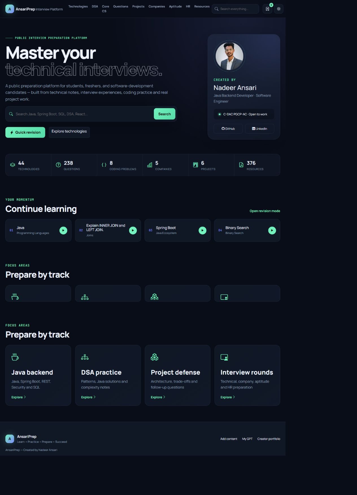
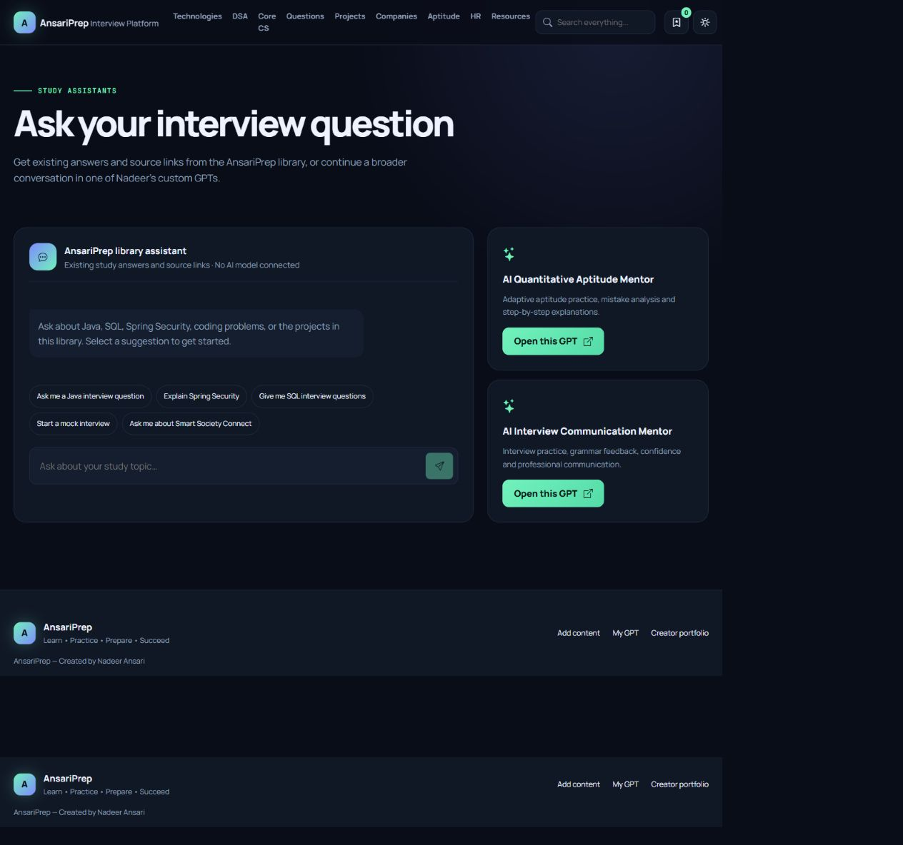
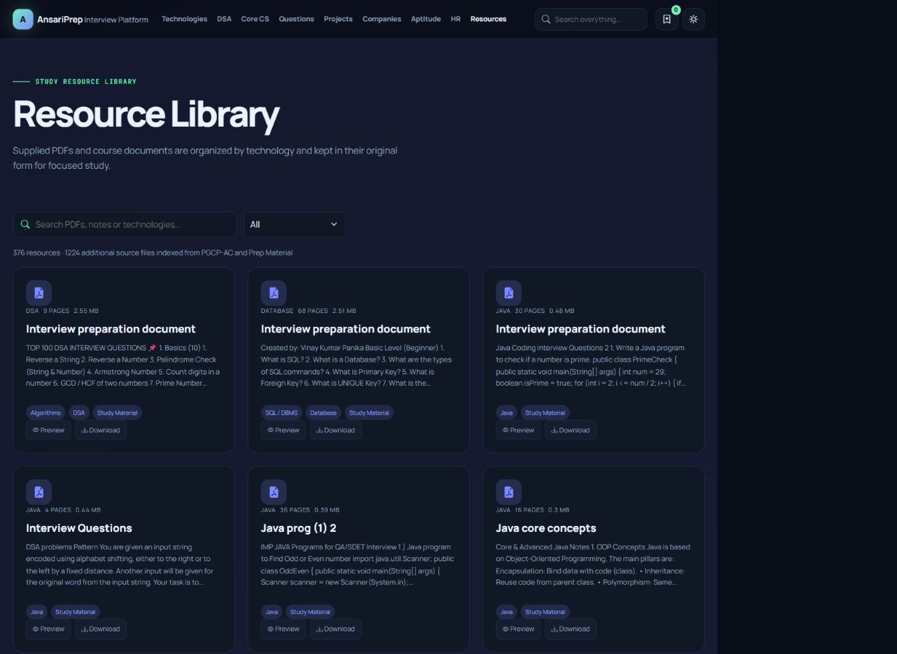

# AnsariPrep

**Learn • Practice • Prepare • Succeed**

AnsariPrep is a public interview preparation platform for students, freshers, and software development candidates. It brings technical study notes, interview questions, Java first DSA practice, project preparation, aptitude and HR material, and supplied documents into one searchable learning hub.

Created by Nadeer Ansari.

## Screenshots

### Home



### Study assistant and custom GPT links



### Resource library



## Features

- Search across technologies, questions, DSA problems, projects, companies, resources, aptitude and HR prompts.
- Explore 44 technology and core subject areas.
- Review structured interview questions with short answers, explanations, follow ups, bookmarks and completion tracking.
- Practice Java first DSA problems and run a self evaluated mock interview.
- Prepare project explanations with factual project details and team contribution notes.
- Browse and preview supplied PDFs and download study files.
- Save bookmarks, recently opened topics, local HR answer drafts and study progress in browser storage.
- Use the library assistant to find existing structured answers, project summaries, mock interview links and matching resource files.
- Open Nadeer Ansari's AI Quantitative Aptitude Mentor and AI Interview Communication Mentor custom GPTs.
- Add local study content through the content form.
- Switch between dark and light themes.

The library assistant currently finds existing material; it is not a generative AI service and does not read and reason over every document. The custom GPT links open in ChatGPT. Do not enter an API key into browser code. A future model integration should run through a secured server and use retrieval over the chosen source files.

## Technology

- React 19 and JavaScript
- Vite
- Bootstrap 5 and Bootstrap Icons
- React Router
- Structured data in `src/data`
- Browser `localStorage` for personal progress and drafts

## Run locally

Requirements: Node.js 20 or newer and pnpm.

```bash
pnpm install
pnpm dev
```

Vite prints the local preview URL in the terminal. Create a production build with:

```bash
pnpm build
pnpm preview
```

## Project layout

```text
src/
  components/       Reusable interface components
  context/          Browser-persisted study state
  data/             Curated and imported content
  services/         Search and assistant logic boundaries
  App.jsx           Routes and page components
  styles.css        Theme, layout and responsive styles
public/
  assets/           Portfolio and project images
  resources/        Supplied study documents
scripts/            Source import helpers
docs/screenshots/   README screenshots
```

## Add and update study content

- Add curated questions, DSA problems, technologies, projects, companies, aptitude topics or HR prompts in `src/data/content.js`.
- Keep reusable content objects in the data layer rather than placing large content blocks inside page components.
- Add resource metadata to `src/data/generatedResources.json` and the corresponding file under `public/resources/`.
- The Add Content page stores entries in the current browser only. Those entries are not automatically shared between visitors or included in source control.
- `src/services/assistantService.js` matches assistant questions against the structured data and returns matching study links. Add a secured backend service before connecting a generative model.

## Data and privacy

Bookmarks, completed items, recent learning, theme selection, and HR drafts use `localStorage` in the visitor's browser. Clearing site data removes these values. The application currently has no account system, shared cloud database, or server-side personalization.

## Deployment

The production output is the static `dist/` directory. Build with `pnpm build` and publish `dist/` to a static host such as GitHub Pages, Netlify, or Cloudflare Pages. Configure the host to serve `index.html` for client-side routes such as `/resources` and `/ask-gpt`.

For GitHub Pages, configure the repository's Pages deployment workflow to install dependencies, run `pnpm build`, and publish `dist/`. Set the Vite `base` option if the site will be served from a repository subpath rather than a custom domain or account root.

## Future API integration

The frontend separates content from views and includes service modules that can later call a Spring Boot API. A future backend could expose routes such as `GET /api/questions`, `GET /api/resources`, and `POST /api/questions`. Use server-side authentication and authorization before adding shared content editing. Keep API credentials in server secrets.
